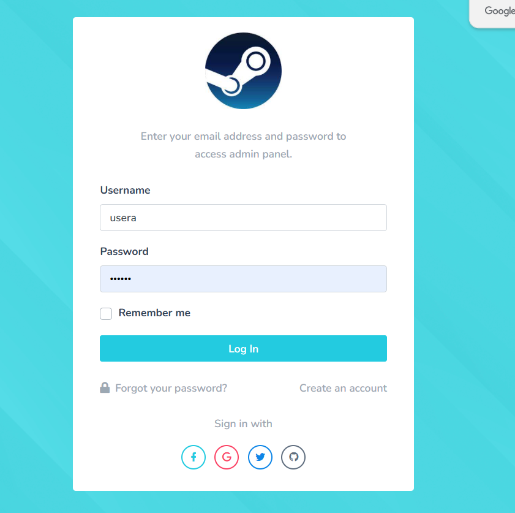

# 🎮 Steam Game Data Visualization & Recommendation Web App

A full-stack Flask project that collects and visualizes Steam game data using **Selenium** web scraping. Users can explore detailed game information, search games by keywords, view visual analytics with graphs and word clouds, and even get **personalized game recommendations** using a user-based collaborative filtering system.

All game data is stored and managed using a **relational SQL database** for efficient querying and persistence.

## 🌟 Features

- 🔐 **User sign-up/login system** to save and personalize data
- 🔍 **Search** for games by keyword
- 📊 **Visualize game data** across various categories using dynamic graphs
- ☁️ Generate **word clouds** from game tags and genres
- 💡 **Recommend games** to users based on interests and preferences
- 📦 Display game details including:
  - Name
  - Price
  - Game Type
  - Ratings
  - Publishers
  - Cover Images

## 🛠️ Tech Stack

- **Frontend**: HTML, CSS, JavaScript
- **Backend**: Flask (Python)
- **Web Scraping**: Selenium
- **Database**: SQL (e.g., MySQL, SQLite)
- **Visualization**: ECharts, WordCloud
- **Recommendation System**: User-based Collaborative Filtering

### 🔐 User Authentication

Users can sign up and log in to:

- Save preferences and browsing history
- Receive personalized game recommendations
- Access user-specific data and suggestions

## 📸 Screenshots

### 🖼️ Login & Sign-Up Screens




### 🏠 Home Page

The home page offers an intuitive and clean interface where users can:

- See featured game categories and quick stats
- Navigate to visualizations, recommendations, and more

### 🖼️ Home Page Preview


### 🔍 Game Search Interface


### 📊 Data Visualization


### ☁️ Word Cloud


### 🎯 Game Recommendations


> 💡 *Replace the image paths (`images/...`) with your actual image locations or URLs.*

## 🚀 How to Run

1. **Clone the repository**

```bash
git clone https://github.com/yourusername/steam-game-visualizer.git
cd steam-game-visualizer
Create a virtual environment & install dependencies

bash
Copy
Edit
python -m venv venv
source venv/bin/activate  # On Windows: venv\Scripts\activate
pip install -r requirements.txt
Set up the SQL database

Create a database (e.g., steam_games.db or MySQL instance)

Run the schema setup script or let the app create tables on first run

Run the Flask app

bash
Copy
Edit
python app.py
Access the app

Open your browser and go to: http://localhost:5000

📂 Project Structure
cpp
Copy
Edit
steam-game-visualizer/
│
├── static/
│   ├── css/
│   └── js/
├── templates/
│   └── *.html
├── images/
│   └── (screenshots & visuals)
├── app.py
├── scraper.py
├── recommender.py
├── database.py
├── requirements.txt
└── README.md

🤝 Contributing
Feel free to fork this repo, create an issue, or submit a pull request!

vbnet
Copy
Edit
